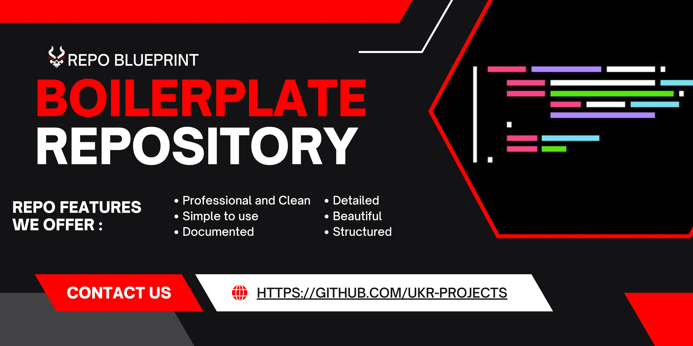

<h1>Repo Blueprint</h1> 

[](LICENSE)
[](STATUS.md)
[](CHANGELOG.md)

<div align="center">
  
</div>

<div align="center">
  
</div>

---


---

## ✨ Features
- **Feature 1**: Brief description of key functionality
- **Feature 2**: Another important capability
- **Feature 3**: What makes this project special
- **Cross-platform**: Works on Windows, macOS, and Linux

---

## 🎉 What’s New in v0.1.0

- **Professional UI Redesign**
  - Complete visual overhaul with a new professional dark theme.
  - Consistent styling across all widgets using a dedicated QSS stylesheet.
  - Improved layout with a larger default window size for a better user experience.
- **Enhanced Download Progress**
  - Added a visual progress bar to the "Activity" page for real-time download feedback.
  - The progress bar is updated dynamically by parsing `yt-dlp`'s output.
- **Code Refinements**
  - Removed all inline styling in favor of the new stylesheet.
  - Added object names to widgets for more specific styling.
  - Updated version number to 2.4.0 in the "About" dialog.

---


## 🚀 Quick Start

### Prerequisites

- Node.js 18+ (or your technology requirements)
- Git
- Any other dependencies

### Installation

```bash
# Clone the repository
git clone https://github.com/username/repo-name.git

# Navigate to the project directory
cd repo-name

# Install dependencies
npm install

# Start the application
npm start
```

## 📖 Documentation

### Basic Usage

```javascript
// Example code snippet showing how to use your project
import { YourLibrary } from 'your-library';

const example = new YourLibrary({
  option1: 'value1',
  option2: 'value2'
});

example.doSomething();
```

### Configuration

Create a `.env` file in the root directory:

```env
API_KEY=your_api_key_here
DATABASE_URL=your_database_url
PORT=3000
```

### Advanced Usage

For more detailed documentation, see our [Wiki](https://github.com/username/repo-name/wiki) or check out the [API Documentation](docs/api.md).

## 🛠️ Development

### Project Structure

```
repo-name/
├── src/                 # Source code
│   ├── components/      # Reusable components
│   ├── utils/          # Utility functions
│   └── index.js        # Main entry point
├── tests/              # Test files
├── docs/               # Documentation
├── assets/             # Images, icons, etc.
├── .github/            # GitHub workflows and templates
├── package.json        # Dependencies and scripts
└── README.md          # This file
```

### Available Scripts

- `npm start` - Start the development server
- `npm test` - Run the test suite
- `npm run build` - Build for production
- `npm run lint` - Run linting
- `npm run format` - Format code with Prettier

### Running Tests

```bash
# Run all tests
npm test

# Run tests in watch mode
npm run test:watch

# Run tests with coverage
npm run test:coverage
```

## 🤝 Contributing

We welcome contributions! Please see our [Contributing Guide](CONTRIBUTING.md) for details.

### How to Contribute

1. Fork the repository
2. Create your feature branch (`git checkout -b feature/AmazingFeature`)
3. Commit your changes (`git commit -m 'Add some AmazingFeature'`)
4. Push to the branch (`git push origin feature/AmazingFeature`)
5. Open a Pull Request

### Code of Conduct

This project follows our [Code of Conduct](CODE_OF_CONDUCT.md). Please read it before contributing.

## 📋 Roadmap

- [ ] Feature 1 implementation
- [ ] Performance optimizations
- [ ] Mobile app support
- [ ] API v2 release
- [x] Initial release
- [x] Basic documentation

See the [open issues](https://github.com/username/repo-name/issues) for a full list of proposed features and known issues.

## 📊 Performance

| Metric | Value |
|--------|-------|
| Bundle Size | 25KB gzipped |
| Load Time | < 100ms |
| Test Coverage | 95% |

## 🔧 Built With

- [Technology 1](https://example.com) - Description
- [Technology 2](https://example.com) - Description
- [Technology 3](https://example.com) - Description

## 🌟 Sponsors

This project is supported by:

- [Sponsor Name](https://sponsor-link.com)

## 📈 Stats


## 📝 Changelog

All notable changes to this project are documented in [CHANGELOG.md](CHANGELOG.md).

## 📄 License

This project is licensed under the MIT License - see the [LICENSE](LICENSE) file for details.

## 🙏 Acknowledgments

- Hat tip to anyone whose code was used
- Inspiration sources
- Libraries and tools that made this possible

## 📞 Support

- 📧 Email: support@yourproject.com
- 💬 Discord: [Join our community](https://discord.gg/yourserver)
- 🐛 Issues: [GitHub Issues](https://github.com/username/repo-name/issues)
- 📖 Docs: [Documentation Site](https://docs.yourproject.com)

## 🔗 Links

- [Website](https://yourproject.com)
- [Documentation](https://docs.yourproject.com)
- [Blog](https://blog.yourproject.com)
- [Twitter](https://twitter.com/yourproject)

---

<div align="center">
  Made with ❤️ by <a href="https://github.com/ukr-projects">ukr</a>
</div>

---
